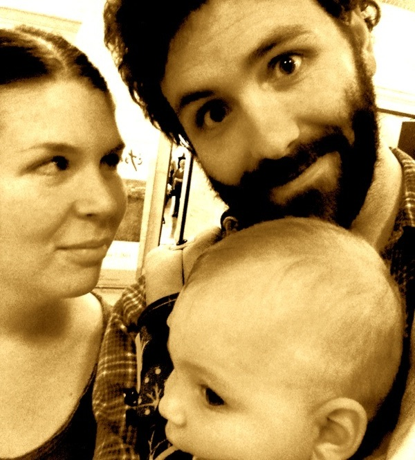

# {{ page.title }}

Mr. Blue Bison is the creative journal of the Vallandingham family.

The art on display is sporadic, varied, and of questionable value - but also spontaneous, wondrous, and special.

Bethany's medium of choice typically involves a textile of some sort. Her sewing, stitching, and screen-printing projects leave their viewers breathless.

Jim is a <a href="http://vallandingham.me">data visualizer</a> by trade. For him, block and screen printing are a nice escape from the constant barrage of 1's and 0's we all face in this modern world. His work shows that his fingers' aptitude for pressing down on keys of a keyboard does not necessarily translate to artistic prowess.

<i>Jim &amp; Bethany &amp; Child, For Reals This Time</i>

We reside in a wonderful home in a wonderful neighborhood of Seattle. Come visit any time.

<i>Travel and Migrations of the Vallandingham Family</i>

